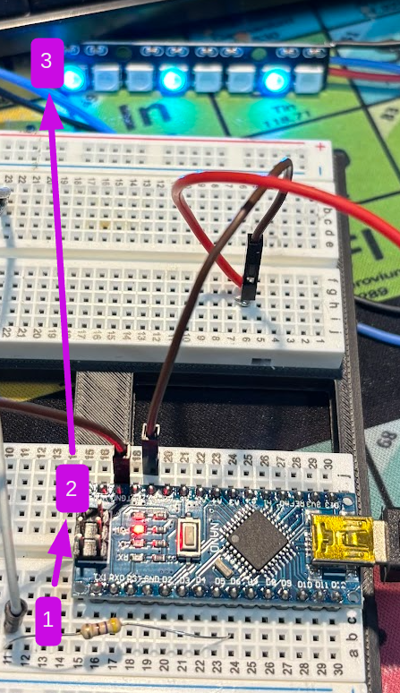

# Easy Does It: Arduino Nano + 1x8 RGB Beginner Project

This project teaches absolute beginners how to wire and program a microcontroller by animating a small RGB LED board.

## What you will learn

- What a microcontroller does
- Why `5V`, `GND`, and a data pin are required
- How addressable LEDs (WS2812/NeoPixel style) receive data
- How to upload firmware to an Arduino Nano
- How to adjust animation speed and brightness safely

## Project image (your labeled setup)



Your labels in the image:
- **1** = resistor (data line protection)
- **2** = Arduino Nano
- **3** = 1x8 RGB board

## Detailed parts list

### Required parts

| Qty | Part | Example / Spec | Why it is needed |
|---:|---|---|---|
| 1 | Arduino Nano (ATmega328P) | CH340 or FTDI USB version | Main microcontroller |
| 1 | 1x8 addressable RGB board | WS2812B / NeoPixel type, pins `IN/OUT/VCC/GND` | 8 controllable LEDs |
| 1 | USB cable for Nano | USB data cable (not charge-only) | Program + power the Nano |
| 3-4 | Jumper wires | Male-male, or as needed for your board | Electrical connections |

### Strongly recommended parts

| Qty | Part | Value / Spec | Why it helps |
|---:|---|---|---|
| 1 | Resistor (series on data) | `330Ω` to `470Ω` | Protects LED data input, reduces signal ringing |
| 1 | Electrolytic capacitor | `1000µF`, `6.3V` or higher | Smooths power spikes on LED board |

### Optional parts (nice for teaching)

| Qty | Part | Why useful |
|---:|---|---|
| 1 | Solderless breadboard | Cleaner layout for beginners |
| 1 | Multimeter | Teaches voltage checks and debugging |
| 1 | Pushbutton + 10k resistor | Future upgrade: switch animation modes |

## Wiring (Nano -> RGB board `IN` side)

Use the side of the RGB board labeled `IN`.

- Nano `5V` -> RGB board `VCC`
- Nano `GND` -> RGB board `GND`
- Nano `D6` -> resistor -> RGB board `IN`
- Leave the `OUT` side unconnected for this beginner build

Power note:
- For this small 8-LED board, Nano USB power is fine at low brightness.
- Keep brightness modest (this project uses `BRIGHTNESS = 40`).

## Code in this repo

- Arduino IDE sketch: `nano_rgb_test/nano_rgb_test.ino`
- PlatformIO sketch: `src/main.cpp`

The current firmware runs:
- Solid red/green/blue/white
- Color wipe
- Theater chase
- Rainbow cycle
- Breathing white

## Arduino IDE upload steps (beginner route)

1. Install Arduino IDE.
2. Open `nano_rgb_test/nano_rgb_test.ino`.
3. Install library: **Adafruit NeoPixel**.
4. Set:
	 - `Tools > Board > Arduino Nano`
	 - `Tools > Processor > ATmega328P`
	 - If upload fails, switch to `ATmega328P (Old Bootloader)`
	 - `Tools > Port` -> your Nano port (`/dev/ttyUSBx` on Linux)
5. Click **Upload**.

## PlatformIO upload steps (advanced beginner route)

```bash
cd /home/kali/esp32-wroom32-mini
pio run -e nanoatmega328 -t upload --upload-port /dev/ttyUSB1
```

If your Nano uses new bootloader instead:

```bash
pio run -e nanoatmega328new -t upload --upload-port /dev/ttyUSB1
```

## Beginner troubleshooting

- LEDs do nothing:
	- Confirm wire goes to LED board `IN` side, not `OUT`
	- Confirm shared ground (`Nano GND` to LED `GND`)
	- Confirm `D6` is connected to data input
- Upload fails with `not in sync`:
	- Try old bootloader profile (`nanoatmega328` / `ATmega328P (Old Bootloader)`)
- Port changes from `/dev/ttyUSB0` to `/dev/ttyUSB1`:
	- Re-select current port and retry
- Random flicker:
	- Add the series resistor and `1000µF` capacitor

## Teach-the-basics talking points

- **Microcontroller**: small computer repeatedly running your `loop()`.
- **GPIO pin**: a programmable pin used here to send LED data (`D6`).
- **Ground reference**: devices need common `GND` to understand signals.
- **Timing**: animation speed comes from delays (`SPEED_MS`).
- **Abstraction**: functions like `rainbowCycle()` organize behavior.

## Project status

- Firmware compiled and uploaded successfully to Nano in this environment.
- Working profile used: old Nano bootloader (`nanoatmega328`).
- Full timeline: `docs/PROJECT_LOG.md`

## Extra docs

- Detailed parts list: `docs/PARTS_LIST.md`
- Full build log: `docs/PROJECT_LOG.md`
- GitHub publishing checklist: `docs/GITHUB_PUBLISH_CHECKLIST.md`
