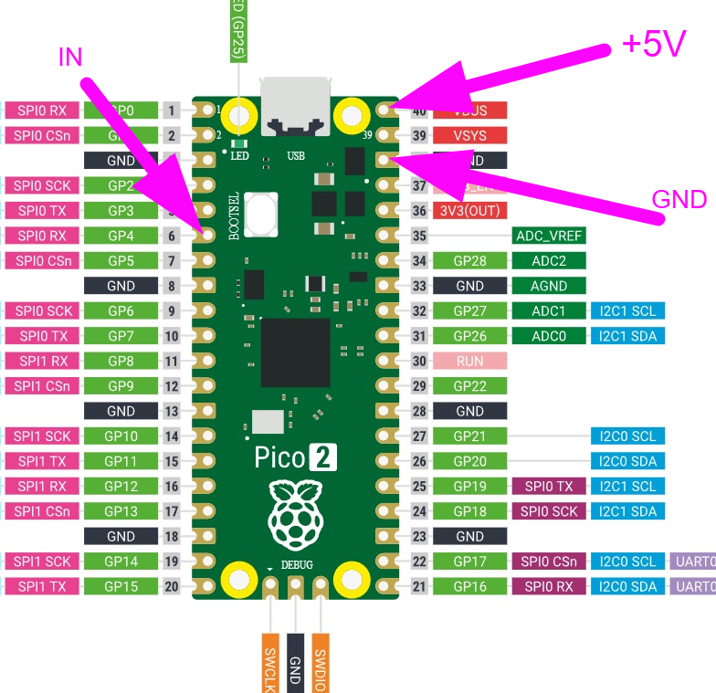

# PicoTube WiFi Lamp (Pico 2W + WS2812)

A tiny Wi-Fi controlled LED lamp project for Raspberry Pi Pico 2W.

This firmware turns the Pico into a standalone Wi-Fi access point and serves a built-in web app so you can control a small WS2812/NeoPixel LED board from your phone, computer, or tablet.

---

## What this project does

- Runs a **local Wi-Fi AP** named `picoled`
- Hosts a **Web UI** (typically `http://192.168.4.1`; on some iPhones `http://192.168.42.1`)
- Supports **manual color selection** (RGB + brightness)
- Includes colorful animated presets:
  - Rainbow Flow
  - Theater Chase
  - Breathing White
  - Classic Vacuum Tube Amber
  - Candy Alternating
  - Ocean Alternating
- Supports **All Off** from the web page

---

## Wiring / solder points

Use the wiring shown in:



### Signal and power connections

- Pico 2W `VBUS (5V)` -> LED board `VCC`
- Pico 2W `GND` -> LED board `GND`
- Pico 2W `GP6` (physical pin 9) -> LED board `DIN` / `IN`

### Data resistor note

In the example photo/build, the blue data cable includes an inline resistor with heat shrink.

- For your own build, place a resistor in series between `GP6` and LED `DIN`
- Typical value for WS2812 data protection is **330Ω to 470Ω**

If your inline resistor is truly `470kΩ`, that is too high for WS2812 data signaling. In that case replace it with `330Ω` to `470Ω`.

### Recommended stability parts

- 1x electrolytic capacitor, **470µF to 1000µF** (>= 6.3V), across LED `VCC`/`GND`

---

## Parts list

- 1x Raspberry Pi Pico 2W
- 1x WS2812/NeoPixel LED board (2x2 / 4 LEDs)
- 1x USB cable for Pico 2W (data capable)
- 3x jumper wires (5V, GND, DATA)
- 1x inline data resistor (330Ω to 470Ω)  
  (optional if your data wire already has one inline)
- 1x electrolytic capacitor 470µF to 1000µF (recommended)

---

## Web UI usage (phone/computer)

1. Power the Pico with this firmware.
2. On your phone/computer, join Wi-Fi network: `picoled`
3. Open a browser to: `http://192.168.4.1`
  - If that does not load (especially on iPhone), try: `http://192.168.42.1`
4. Use the controls:
   - **Open Color Palette** -> choose color -> **Apply Manual Color**
   - Pick any preset in **Colorful Presets**
   - Use brightness slider at any time

### Web UI preview


---

## Build and flash

### Build firmware

```bash
cd /home/kali/pico-rgb-tube
pio run -e pico2w
```

### UF2 output

```text
.pio/build/pico2w/firmware.uf2
```

### Easy download file (no build needed)

For users who only want to drag-and-drop firmware, this repository also includes:

```text
firmware.uf2
```

That file is placed at the project root (same level as this README).

### Flash via USB mass storage (recommended)

1. Hold `BOOTSEL` on Pico 2W and plug in USB.
2. Release `BOOTSEL` (drive `RPI-RP2` appears).
3. Copy UF2:

```bash
cp .pio/build/pico2w/firmware.uf2 /media/$USER/RPI-RP2/
```

The board reboots automatically and starts the Wi-Fi lamp firmware.

---

## Configuration used

Current project defaults (from `platformio.ini`):

- `LED_PIN=6` (GP6)
- `LED_COUNT=4`
- `BRIGHTNESS=230` (~90%)
- AP SSID = `picoled`

---

## Notes

- Upload from PlatformIO task may fail on some systems; UF2 drag-and-drop is the most reliable path.
- For small 4-LED loads this runs well from a good 5V supply.
- If you see flicker, confirm shared ground and keep the data resistor/capacitor in place.
